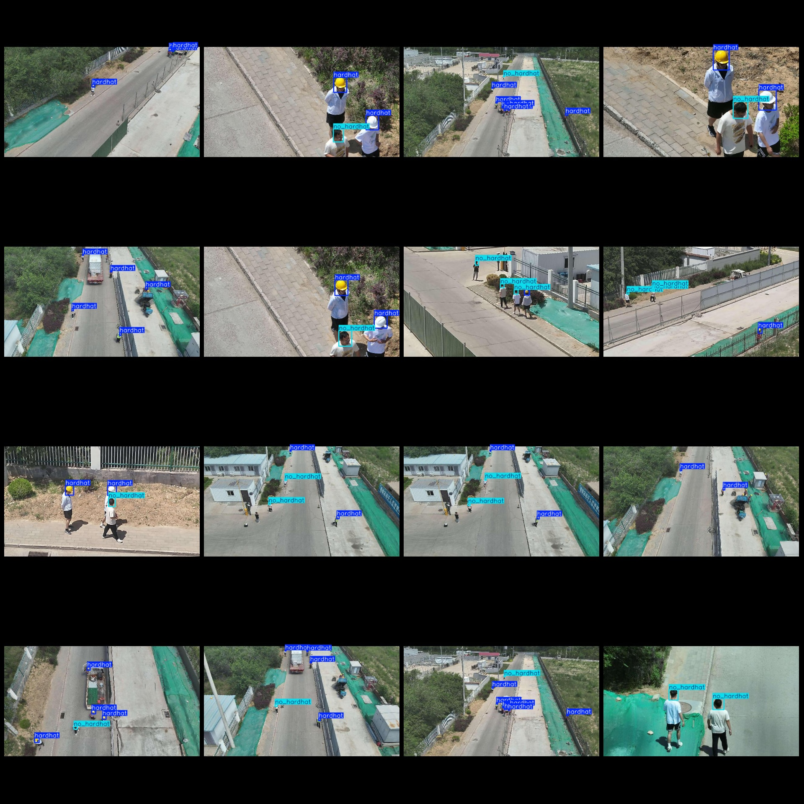
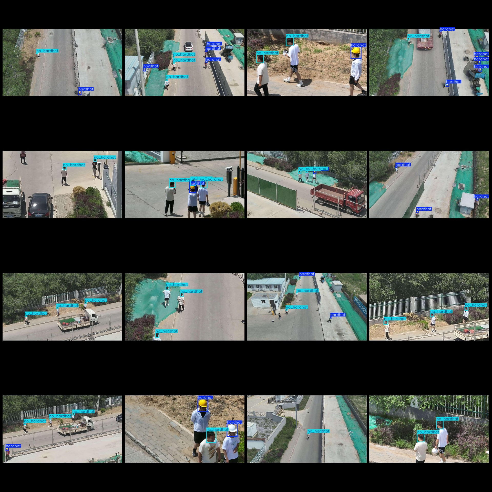

# Drone Viewpoint Worker Safety Helmet Detection Dataset - VOC+YOLO Format with 3008 Images in 2 Classes

Dataset format: Pascal VOC format + YOLO format (txt file without split path, only containing jpeg images along with corresponding VOC format xml files and YOLO format txt files)

Number of images (jpg file count): 3008
Number of annotations (xml file count): 3008
Number of annotations (txt file count): 3008
Number of annotation categories: 2
Annotation category names (note that the order in the YOLO format is not consistent with this, but refer to the "labels" folder's "classes.txt" for accuracy): ["hardhat", "no_hardhat"]

Each category has:
- Hardhat (helmet) box count = 6225
- No hardhat (without helmet) box count = 5121
Total box count: 11346

Each category occupies a certain number of images:
- Hardhat (helmet) occupies images = 2311
- No hardhat (without helmet) occupies images = 2615

Image resolution: 640x640
Drone: DJI MAVIC 3
Capture height: 10-50m
Capture angle: 60-90°
Annotation tool used: labelImg
Annotation rules: draw boxes around categories

Important note: The dataset does not have been divided into training, validation, or test sets; you need to do that yourself.
Special declaration: This dataset does not guarantee the precision of the trained models or weight files.

Image preview:

Annotation examples:

## Images

Here is a pay link on Stripe ( https://buy.stripe.com/3cs8yP7sY87d0vu9AB ). Please contact me lonlonago@foxmail.com after funding $89, and I will send you a complete data files , thank you!

